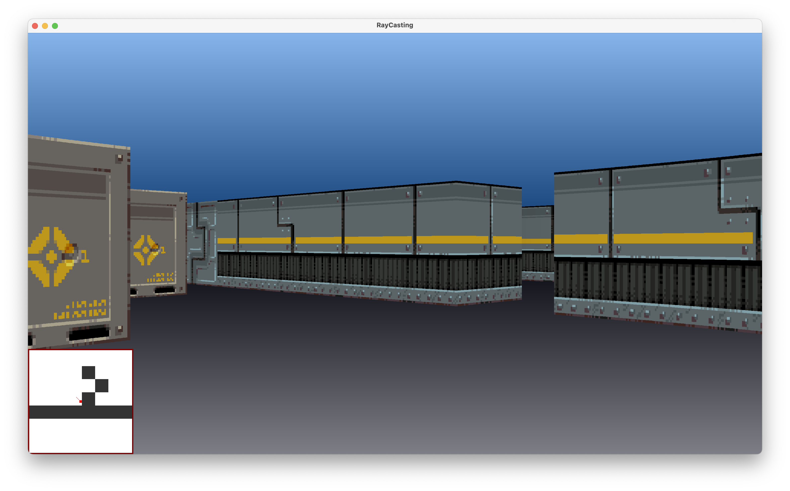

# Raycasting Engine

A simple raycasting engine written in **C++**, inspired by classic games like **Wolfenstein 3D**. This project demonstrates how to create a pseudo-3D environment using 2D techniques.
Raycasting is a rendering method used to simulate a 3D view from a 2D map. In the early days of computing, real-time 3D engines were too demanding, so raycasting became the go-to solution. It’s highly efficient because it only requires one calculation per vertical screen column.




---

## Features

- 2D to 3D raycasting engine
- Player movement and input handling
- Scene rendering with wall textures
- Map parsing from plain text files
- Texture support (`.raw`)
- Easily extendable map and scene system
- More to come...

---

## Project Structure

```bash
Raycasting-main/
├── include/           # Header files
├── src/               # Core engine and logic
├── maps/              # Level definitions
├── textures/          # Wall textures
├── main.cpp           # Application entry point
├── Makefile           # Build configuration
├── stb_image_write.h  # External image writing utility
├── output.png         # Sample render output
└── README.md          # Project documentation
```

---

## Build Instructions

Prerequisites
A `C++17` compatible compiler (e.g., **g++, clang++**) and OpenGL essentials ([GLFW](https://www.glfw.org/)).

`make`

This will compile the project and create an executable in the root directory **only for macOS** for now.
Compiling the program in other systems depends on your version of system and supordted packages. You can find the
main flags inside [MAKEFILE](MAKEFILE)

Running the Program
After compilation, you can run the program using:
`./rc maps/map1 (or any other map)`


## Maps
You can find several predefined maps in the `maps/` directory. Each map file represents a 2D grid that the engine interprets for wall positions. To create new map you need to ensure that your map does not have unreachble parts and that the map has closed borders. You need to specify the textures in the top of the map file (you can see an example in `maps/map1` file).

## Controlls

You can controll your movement by **W,A,S,D** keys, rotate the camera with **left and right arrows**, run by holding the **left shift** button and interact with some items in the map with **E**.

## Textures
Textures are stored in the textures/ directory in .raw format.Texture mapping is done using basic linear algebra (vectors, angles)

## Concepts Used 
Raycasting algorithm


## License
This project is licensed under the terms of the LICENSE file provided in the repository.


## Authors
Developed by [Hrant Hovhannisyan](https://github.com/TheOlifve) and [Armen Balagyozyan](https://github.com/gaxkalik) — feel free to contribute or fork!

## Contact
For questions, email [gaxkalik@gmail.com](gaxkalik@gmail.com) or [hrant.hovhannisyan2413@gmail.com](hrant.hovhannisyan2413@gmail.com).
